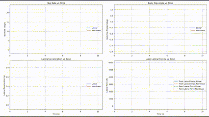

# Vehicle Modelling and Behaviour Assessment


This project simulates the **Single Track (Bicycle) Vehicle Model** using two tyre models—**Linear** and **Non-linear (Pacejka)**—to study vehicle response characteristics: yaw rate, lateral acceleration, body slip angle, and lateral tyre forces under a steering maneuver.

---

## 🚗 Theory

### 🔹 Single Track Model (STM)

The STM simplifies a four-wheeled vehicle into a two-wheel model—one at the front and one at the rear—aligned along the longitudinal axis. It captures essential **lateral dynamics** using two key state variables:
- **Lateral velocity (`v`)**
- **Yaw rate (`r`)**

---

### 🔸 Linear Tire Model

The linear model assumes tire lateral force is directly proportional to slip angle:
**Fᵧ = Cₐ × α**

Where:
- **Fᵧ**: Lateral force  
- **Cₐ**: Cornering stiffness  
- **α**: Slip angle

✅ Simple and computationally efficient  
❌ Valid only for small slip angles and moderate forces

---

### 🔸 Non-linear Tire Model (Pacejka "Magic Formula")

This model captures tire behavior more realistically:
**Fᵧ = D · sin( C · arctan[ Bα − E(Bα − arctan(Bα)) ] )**

Where:
- **B, C, D, E**: Curve-fitting parameters  
- **α**: Slip angle

✅ Captures saturation, peak force, and load sensitivity  
❌ More complex and computationally heavier

---

## 🧪 Simulation Setup

- **Vehicle speed:** 80 km/h  
- **Input:** 4° left ramp steering  
- **Simulation duration:** 10 seconds  
- **Solvers used:** `solve_ivp` with Radau method  
- **Models evaluated:** Linear vs. Non-linear

---

## 📈 Results Interpretation



This animation compares key vehicle dynamic responses between the linear and non-linear models:

1. The non-linear model saturates at a lateral acceleration of 0.75 [g], whereas the linear model reaches a lateral acceleration of 0.84 [g].

2. The body slip angle for the non-linear model exceeds the same angle for the linear model.

3. Especially, the yaw rate and body slip angle show a significant overshoot. This is a concequence of the understeer characteristics of the vehicle. With a lower understeer gradient, this overshoot is reduced.

4. The largest axle forces are observed at the front axle. As a result, the vehicle will skid out at the front axle if the lateral acceleration is furthur increased. This also a consequence of the understeer characteristics of the vehicle.

5. The body slip angle shows a first opposite peak in the beginning of the manoeuvre. This is due to the effect that it takes time for the vehicle to build up tyre forces. With a first immediate steering at the front axle, the local speed direction of the vehicle is oriented towards the center of the curve and then moves outward of the curve. This leads to the change in the body slip angle sign.

---

## 📁 Project Structure

```plaintext
📦 Vehicle Modelling Project
├── vehicle_modelling.py        # Main simulation script
├── plots/
│   ├── lateral_acceleration.png      # Lateral acceleration vs time
│   ├── yaw_rate.png                  # Yaw rate vs time
│   ├── body_slip_angle.png          # Body slip angle vs time
│   └── lateral_forces.png           # Tyre lateral forces vs time
├── stm.png                    # Vehicle model diagram
├── plots.gif                  # Simulation output animation
└── README.md                  # Project description and documentation
```
---

## 📌 Conclusion

This project demonstrates the importance of accurate tire modeling in vehicle dynamics simulations. While the linear model is suitable for small-angle, low-demand maneuvers, the non-linear Pacejka model provides crucial fidelity under aggressive steering or high-speed conditions.

---

## 📄 License
This project is open source and available under the MIT License.

### 🙋‍♂️ Author
Anurakt Raj Mathur
💼 [LinkedIn](https://www.linkedin.com/in/anurakt-raj-mathur)
📬 Email: anuraktrajmathur@gmail.com
