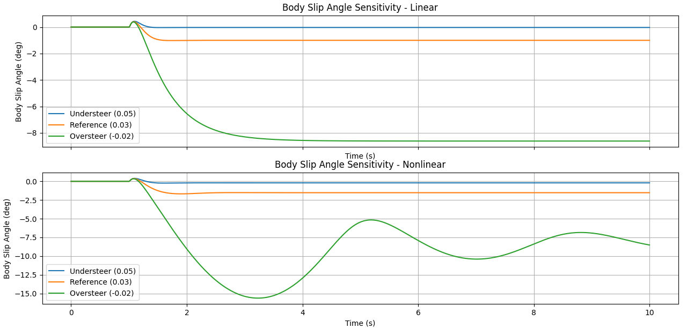
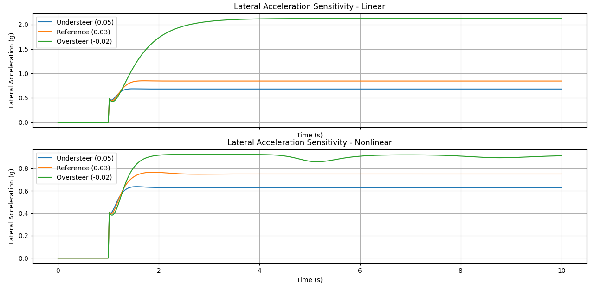
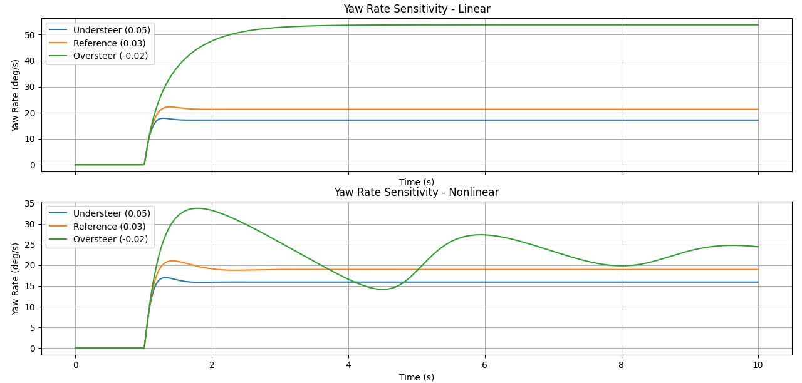

# Vehicle Modelling and Behaviour Assessment


This project simulates the **Single Track (Bicycle) Vehicle Model** using two tyre models—**Linear** and **Non-linear (Pacejka)**—to study vehicle response characteristics: yaw rate, lateral acceleration, body slip angle, and lateral tyre forces under a steering maneuver.

---

## 🚗 Theory

### 🔹 Single Track Model (STM)

The STM simplifies a four-wheeled vehicle into a two-wheel model—one at the front and one at the rear—aligned along the longitudinal axis. It captures essential **lateral dynamics** using two key state variables:
- **Lateral velocity (`v`)**
- **Yaw rate (`r`)**

---

### 🔸 Linear Tyre Model

The linear model assumes tyre lateral force is directly proportional to slip angle:
**Fᵧ = Cₐ × α**

Where:
- **Fᵧ**: Lateral force  
- **Cₐ**: Cornering stiffness  
- **α**: Slip angle

✅ Simple and computationally efficient  
❌ Valid only for small slip angles and moderate forces

---

### 🔸 Non-linear Tyre Model (Pacejka "Magic Formula")

This model captures tyre behavior more realistically:
**Fᵧ = D · sin( C · arctan[ Bα − E(Bα − arctan(Bα)) ] )**

Where:
- **B, C, D, E**: Curve-fitting parameters  
- **α**: Slip angle

✅ Captures saturation, peak force, and load sensitivity  
❌ More complex and computationally heavier

---

## 🧪 Simulation Setup

- **Vehicle speed:** 80 km/h  
- **Input:** 4° left ramp steering  
- **Simulation duration:** 10 seconds  
- **Solvers used:** `solve_ivp` with Radau method  
- **Models evaluated:** Linear vs. Non-linear

---

## 📈 Results Interpretation


This animation compares key vehicle dynamic responses between the linear and non-linear models:

1. The non-linear model saturates at a lateral acceleration of 0.75 [g], whereas the linear model reaches a lateral acceleration of 0.84 [g].

2. The body slip angle for the non-linear model exceeds the same angle for the linear model.

3. Especially, the yaw rate and body slip angle show a significant overshoot. This is a concequence of the understeer characteristics of the vehicle. With a lower understeer gradient, this overshoot is reduced.

4. The largest axle forces are observed at the front axle. As a result, the vehicle will skid out at the front axle if the lateral acceleration is furthur increased. This also a consequence of the understeer characteristics of the vehicle.

5. The body slip angle shows a first opposite peak in the beginning of the manoeuvre. This is due to the effect that it takes time for the vehicle to build up tyre forces. With a first immediate steering at the front axle, the local speed direction of the vehicle is oriented towards the center of the curve and then moves outward of the curve. This leads to the change in the body slip angle sign.

---

## Sensitivity Analysis
This section presents a **sensitivity analysis** using both linear and nonlinear tyre models. The primary variable under investigation is the understeer gradient (η), with three distinct cases:

- Understeer (η = 0.05)
- Close to Neutral/Reference (η = 0.03)
- Oversteer (η = -0.02)

Each graph below highlights how this gradient affects different aspects of the vehicle's dynamic response, and reveals the limitations of the linear model compared to a more realistic nonlinear model.

## 1. Body Slip Angle (β)


This plot shows the body slip angle (β), which indicates the deviation between the vehicle's velocity vector and heading.

Linear model (top): Predicts stable and gradual increase in slip angle across all η values.

Nonlinear model (bottom): Captures significant instability and oscillations in the oversteer case, indicating the onset of loss of control—something the linear model cannot predict.

Key Insight: The nonlinear model is essential for capturing dynamic instability in oversteering conditions.

## 2. Lateral Acceleration 


This graph illustrates the vehicle’s lateral acceleration, which directly reflects cornering performance.

Linear model (top): Suggests a stable, predictable increase in lateral acceleration.

Nonlinear model (bottom): Highlights reduced peak performance and oscillations under oversteer, demonstrating real-world instability.

Key Insight: Nonlinear effects are critical for predicting performance limits and transient behavior.

## 3. Tyre Lateral Forces


This plot displays the front and rear lateral tyre forces for various understeer gradients.

Linear model (top): Shows a linear rise in forces without saturation.

Nonlinear model (bottom): Reveals force saturation and complex rear tyre behavior under oversteer, indicating realistic tyre grip limits.

Key Insight: Linear models oversimplify tyre behavior and fail to predict saturation or load transfer effects.

## 4. Yaw Rate


This plot tracks the yaw rate, or the rotational speed of the vehicle about its vertical axis.

Linear model (top): Predicts smooth yaw dynamics with increasing steering input.

Nonlinear model (bottom): Captures overshoot and unstable oscillations in the oversteer case.

Key Insight: Linear models underestimate yaw dynamics during oversteer, missing key indicators of potential spinout.

📝 Conclusion

This sensitivity analysis demonstrates the critical limitations of linear modeling in high lateral acceleration or oversteering scenarios. Nonlinear models are necessary to predict:

- Tyre force saturation
- Oscillatory or divergent behavior
- Instability under aggressive maneuvers

Use of nonlinear models ensures more robust vehicle design, controller tuning, and safety evaluation under real-world driving conditions.


## 📁 Project Structure

```plaintext
📦 Vehicle Modelling Project
├── vehicle_modelling.py        # Main simulation script
├── plots/
│   ├── lateral_acceleration.png     # Lateral acceleration vs time
│   ├── yaw_rate.png                 # Yaw rate vs time
│   ├── body_slip_angle.png          # Body slip angle vs time
│   └── lateral_forces.png           # Tyre lateral forces vs time
│   └── subplot.png                  # Comparative subplot of all graphs 
│   └── sensitivity_analysis/
│       └── beta_sa.png              # Body slip angle sensitivity analysis
│       └── fy_sa.png                # Tyre lateral force sensitivity analysis
│       └── lateral_acc_sa.png       # Lateral acceleration sensitivity analysis
│       └── yaw_rate_sa.png          # Yaw rate sensitivity analysis         
├── stm.png                    # Vehicle model diagram
├── plots.gif                  # Simulation output animation
└── README.md                  # Project description and documentation
```
---

## 📌 Conclusion

This project demonstrates the importance of accurate tyre modeling in vehicle dynamics simulations. While the linear model is suitable for small-angle, low-demand maneuvers, the non-linear Pacejka model provides crucial fidelity under aggressive steering or high-speed conditions.

---

## 📄 License
This project is open source and available under the MIT License.

### 🙋‍♂️ Author
Anurakt Raj Mathur
💼 [LinkedIn](https://www.linkedin.com/in/anurakt-raj-mathur)
📬 Email: anuraktrajmathur@gmail.com
